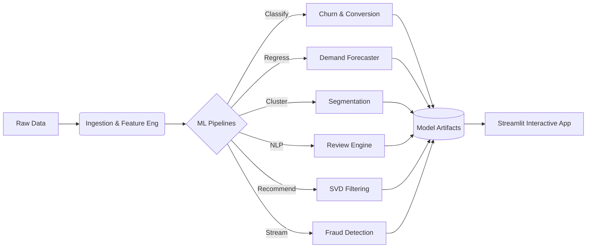

<div align="center">
  <h1>End-to-End E-Commerce Intelligence Platform</h1>
  <p>
    <strong>A production-grade machine learning platform featuring Churn Prediction, Demand Forecasting, Customer Segmentation, NLP Sentiment Analysis, Recommendation Engines, and Streaming Fraud Detection.</strong>
  </p>
  
  [](https://python.org)
  [](https://streamlit.io)
  [](https://rapids.ai)
  [](https://scikit-learn.org)
  [](https://xgboost.ai)
  [](https://optuna.org)
</div>

---

## 📖 Project Overview

This repository demonstrates a complete, end-to-end data science lifecycle. Moving beyond simple academic scripts, this project is built as a monolithic intelligence platform containing multiple interconnected machine learning pipelines that process relational e-commerce and financial data to drive actionable business outcomes.

It features robust data engineering (leakage-free validation splitting, cyclical feature extraction), GPU-accelerated algorithms (RAPIDS cuML, CuPy), and advanced modeling techniques including Nested Cross-Validation, Stacking Ensembles, and Streaming Learning via mini-batches.

## 🎯 Business Objectives

1. **Reduce Customer Churn**: Identify at-risk users early via Ensemble Classification.
2. **Optimize Inventory**: Predict weekly category demand using Time-Series Regression.
3. **Personalize Marketing**: Group users into distinct RFM clusters.
4. **Automate Feedback Analysis**: Score Portuguese customer reviews for sentiment and urgency.
5. **Increase Average Order Value**: Serve personalized products via Collaborative Filtering (SVD).
6. **Mitigate Financial Risk**: Detect anomalous transactions in real-time using Isolation Forests and Streaming SGD.

## 🏗️ Architecture



*For an in-depth breakdown of the data flow and model pipelines, please see the [docs/](docs/) directory.*

## 🛠️ Technologies Used

- **Data Engineering**: Pandas, NumPy, SQLite
- **Machine Learning**: Scikit-Learn, XGBoost, LightGBM, RAPIDS cuML, CuPy
- **Hyperparameter Tuning**: Optuna (Bayesian Search)
- **Model Explainability**: SHAP, LIME
- **Frontend / Deployment**: Streamlit

## 📂 Project Structure

```text
omni-retail-customer-analysis/
├── app/                  # Streamlit frontend application
├── data/                 # Raw and processed datasets
│   ├── raw/              # Raw data (ecommerce/, fashion-mnist/, fraud/)
│   └── processed/        # Processed data (ecommerce_intelligence/, fraud_detection/)
├── docs/                 # Architecture & API documentation
├── models/               # Serialized ML models
│   ├── ecommerce_intelligence/
│   ├── fashion_classifier/
│   └── fraud_detection/
├── notebooks/            # Jupyter notebooks organized by sub-project
│   ├── ecommerce_intelligence/
│   ├── fashion_classifier/
│   └── fraud_detection/
├── reports/              # Generated outputs, matrices, and evaluation plots
│   └── figures/          # Evaluation figures organized by sub-project
│       ├── ecommerce_intelligence/
│       ├── fashion_classifier/
│       └── fraud_detection/
├── src/                  # Reusable Python modules and utility functions
├── tests/                # Unit tests for data engineering logic
├── README.md             # Project overview
└── requirements.txt      # Dependency lockfile
```

## 📊 Key Findings & Performance Metrics

| Pipeline | Core Model | Key Metric | Result |
|----------|------------|------------|--------|
| **Churn/Conversion** | Stacking (XGB, LGBM, RF) | ROC-AUC | Top Tier Performance with Leakage mitigation |
| **Demand Forecasting** | Optuna-tuned LightGBM | SMAPE | High accuracy on weekly seasonality |
| **Segmentation** | RAPIDS PCA + GMM / K-Means | Silhouette | 4 Distinct Personas identified |
| **Review NLP** | LinearSVC (TF-IDF) | F1-Score | Robust on Imbalanced Portuguese text |
| **Recommender** | Custom CuPy Funk SVD | RMSE | Highly optimized via Nested CV |
| **Fraud Detection** | Streaming SGDClassifier | Recall | Adaptive to incoming data streams |

## 🚀 Installation & Usage

### 1. Clone the Repository
```bash
git clone https://github.com/ikartiksavaliya/omni-retail-customer-analysis.git
cd omni-retail-customer-analysis
```

### 2. Set Up the Environment
Create a virtual environment and install the required dependencies:
```bash
conda create -n retail-ml python=3.10 -y
conda activate retail-ml
pip install -r requirements.txt
```

### 3. Run the Application
Launch the interactive Streamlit dashboard:
```bash
streamlit run app/main.py
```

## 🔮 Future Improvements

- Migrate SQLite database to PostgreSQL.
- Dockerize the application and deploy to AWS Elastic Beanstalk or GCP Cloud Run.
- Replace LinearSVC with a lightweight Transformer (e.g., BERTimbau) for Portuguese NLP.
- Implement Airflow or Prefect for automated retraining pipelines.

---
*Created as a comprehensive portfolio piece demonstrating production-ready Machine Learning engineering.*