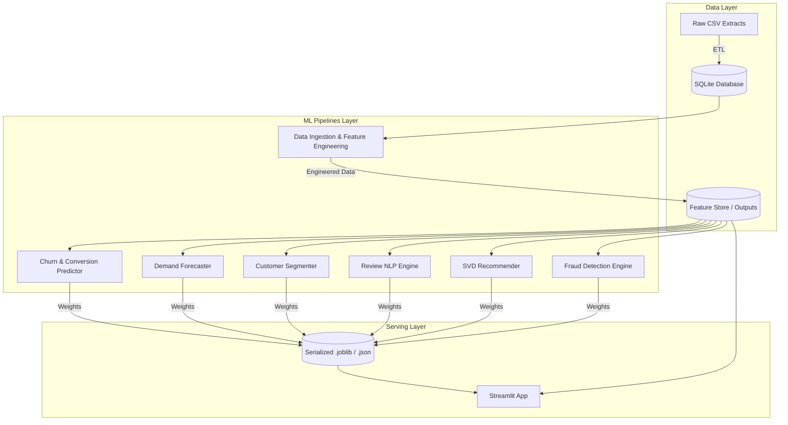

# High-Level Architecture

The **End-to-End E-Commerce Intelligence Platform** is a monolithic repository combining data engineering, multiple machine learning pipelines, and an interactive front-end application.

## System Components

## Technology Stack

- **Data Processing**: Pandas, NumPy, RAPIDS cuML (GPU-accelerated algorithms).
- **Database**: SQLite.
- **Machine Learning**: Scikit-Learn, XGBoost, LightGBM, CuPy (for custom GPU SVD).
- **Hyperparameter Optimization**: Optuna.
- **Explainability**: SHAP, LIME.
- **Serving / App**: Streamlit.
