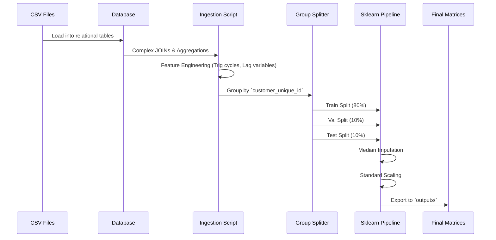

# Data Flow Documentation

This document explains the lifecycle of data as it passes through the E-Commerce Intelligence Platform.

## 1. Ingestion Flow

The ingestion pipeline handles 10+ relational datasets (customers, orders, products, reviews, etc.) and transforms them into ML-ready matrices.

## 2. Feature Engineering Highlights

- **Leakage Prevention**: All features requiring timeline awareness (e.g., actual delivery time, review score) are stripped when predicting events that happen *prior* to those metrics being known (e.g., Conversion Prediction).
- **Cyclical Features**: Timestamp features (hour, day, month) are converted into `sin` and `cos` components to capture cyclicality.
- **RFM Extraction**: Recency, Frequency, and Monetary metrics are calculated for segmentation.
- **Text Vectorization**: Customer reviews are cleaned, normalized, stripped of custom Portuguese stop-words, and converted to TF-IDF vectors capped at 20,000 features.
